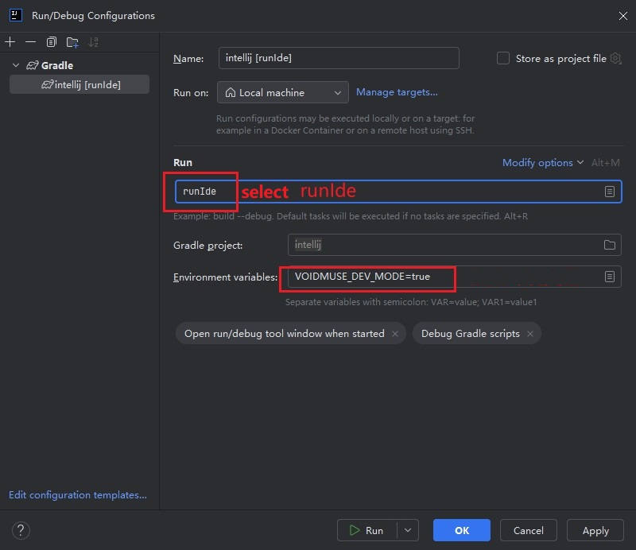

# VoidMuse Development Guide

## 项目结构

VoidMuse 采用独立开发模式，每个组件都有自己的开发和构建脚本：

```
voidmuse/
├── gui/                    # React Web GUI 界面
├── extensions/
│   ├── vscode/            # VSCode 扩展
│   └── intellij/          # IntelliJ IDEA 插件
├── doc/                   # 项目文档
```

## 环境要求

- **Node.js** >= 16.0.0
- **Java** >= 17 (IntelliJ插件开发)
- **Gradle** (IntelliJ插件构建，通过Gradle Wrapper自动管理)
- **VSCode** (VSCode扩展开发)

## 快速开始

### 安装依赖
```bash
# GUI 项目依赖
cd gui && npm install

# VSCode 扩展依赖
cd extensions/vscode && npm install

# IntelliJ 插件使用 Gradle 管理依赖，无需手动安装
```

## 开发环境启动

### 🎨 GUI 开发

```bash
cd gui
npm run dev          # 启动开发服务器 (http://localhost:3002)
npm run build:test   # 构建静态文件版本
npm run preview      # 预览生产构建
npm run lint         # 运行代码检查
```

### 📝 VSCode 扩展开发

```bash
cd extensions/vscode
npm run debug        # 🚀 启动 VSCode 调试环境（推荐）
npm run build-gui    # 仅构建GUI并复制到扩展
npm run dev          # 启动开发环境（自动编译）
npm run build        # 构建和打包扩展
npm run package      # 创建 .vsix 包
```

**VSCode 扩展调试说明：**
- `npm run debug` 会自动：
  1. 构建GUI项目（在gui目录执行`npm run build:prod`）
  2. 删除扩展中的旧GUI资源
  3. 复制新的GUI构建产物到扩展的`gui`目录
  4. 安装VSCode扩展依赖
  5. 编译 TypeScript
  6. 启动 VSCode 并加载扩展进行调试
- 这是最便捷的开发方式，包含完整的GUI构建流程
- VSCode扩展依赖GUI构建产物，`gui/`目录由自动化管理

**重要提示：**
- VSCode扩展依赖GUI构建产物，`gui/`目录由自动化管理，不应手动编辑
- 始终使用 `npm run debug` 获得最新的开发体验
- `.vscode/` 配置文件已包含在版本控制中，确保标准化的开发体验

或者使用独立脚本：
```bash
cd extensions/vscode
node dev.js dev      # 启动开发环境
node dev.js build    # 构建和打包扩展
node dev.js install  # 仅安装依赖
```

### 🧠 IntelliJ 插件开发

#### 前置步骤：启动 GUI 开发服务器
```bash
cd gui
npm install          # 安装依赖
npm run dev          # 启动开发服务器 (http://localhost:3002)
```

#### IntelliJ 插件开发步骤
1. **打开项目**：
   - 启动 IntelliJ IDEA
   - `File → Open` → 选择 `extensions/intellij` 目录
   - 等待 Gradle 同步完成

2. **配置运行环境**：
   - `Run → Edit Configurations`
   - 添加 Gradle 配置：
     - Name: `Run Plugin`
     - Tasks: `runIde`
     - 在 `Environment variables` 中添加：`VOIDMUSE_DEV_MODE=true`
     - 或在 `VM options` 中添加：`-Dvoidmuse.dev.mode=true`

3. **启动调试**：
   - 点击调试按钮启动插件开发环境
   - 插件会自动连接到 GUI 开发服务器

#### 手动构建命令
```bash
cd extensions/intellij
./gradlew build      # 构建插件
./gradlew test       # 运行测试
./gradlew clean      # 清理构建文件
```

#### 开发模式配置
插件支持自动检测开发模式，通过环境变量或系统属性控制：

1. **推荐方式 - 在 IntelliJ IDEA 运行配置中设置**：
   - `Run → Edit Configurations`
   - 在 `Environment variables` 中添加：`VOIDMUSE_DEV_MODE=true`
   - 或在 `VM options` 中添加：`-Dvoidmuse.dev.mode=true`

2. **手动设置环境变量**：
   ```bash
   set VOIDMUSE_DEV_MODE=true     # Windows
   export VOIDMUSE_DEV_MODE=true  # Linux/Mac
   ```

## 依赖管理

每个项目独立管理自己的依赖：

- **GUI**: 使用 npm，依赖安装在 `gui/node_modules/`
- **VSCode**: 使用 npm，依赖安装在 `extensions/vscode/node_modules/`
- **IntelliJ**: 使用 Gradle，依赖由 Gradle 管理

## 工作流程建议

### 日常开发
1. **GUI 开发**：
   ```bash
   cd gui && npm run dev
   ```

2. **VSCode 扩展开发**：
   ```bash
   cd extensions/vscode && npm run debug
   ```

3. **IntelliJ 插件开发**：
   ```bash
   # 1. 启动 GUI 开发服务器
   cd gui && npm install && npm run dev
   
   # 2. 在 IntelliJ IDEA 中打开 extensions/intellij 项目
   # 3. 配置 runIde 任务并设置环境变量 VOIDMUSE_DEV_MODE=true
   # 4. 启动调试
   ```

### 测试发布
1. 构建所有组件并测试功能
2. 确认功能正常后发布

## 故障排除

### GUI 开发服务器问题
- 检查端口 3002 是否被占用
- 确认 GUI 目录下的依赖已安装
- 修改 `vite.config.ts` 中的端口配置（如需要）

### IntelliJ 插件无法连接到开发服务器
- 确认 GUI 开发服务器正在运行
- 检查环境变量或 JVM 参数设置
- 查看 IntelliJ 控制台日志

## 最佳实践

1. **GUI 开发**：使用 `npm run dev` 启动开发服务器
2. **VSCode 扩展开发**：使用 `npm run debug` 获得完整的开发体验
3. **IntelliJ 插件开发**：在 IntelliJ IDEA 中直接打开项目进行开发
4. **构建时**：使用对应的 `npm run build` 或 `./gradlew build` 命令
5. **发布前**：确保所有组件都能正常构建和运行
6. **多人协作**：提交代码前确保开发环境配置文档是最新的
