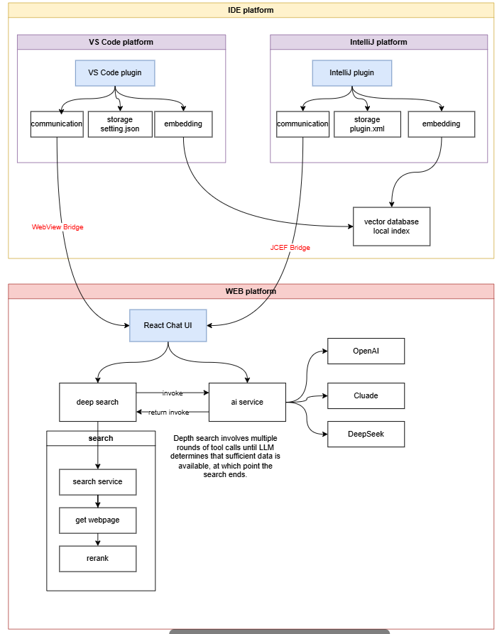

# 🏗️ Technical Architecture

## Overall Architecture Diagram



## Project Structure

```
VoidMuse/
├── gui/                    # Web Frontend Interface (React + TypeScript)
│   ├── src/
│   │   ├── llm/           # AI Model Service Layer
│   │   ├── mcp/           # MCP Protocol Client
│   │   ├── storage/       # Local Storage Service
│   │   ├── services/      # Business Service Layer
│   │   ├── components/    # UI Component Library
│   │   └── contexts/      # React Contexts
│   └── package.json
├── extensions/             # IDE Plugin Code
│   ├── vscode/            # VS Code Plugin (TypeScript)
│   │   ├── src/
│   │   │   ├── services/  # Plugin Services
│   │   │   ├── edit/      # Code Editing Features
│   │   │   └── common/    # Common Utilities
│   │   └── package.json
│   └── intellij/          # IntelliJ Plugin (Java/Kotlin)
│       ├── src/main/
│       └── build.gradle.kts
└── doc/                   # Technical Documentation
    ├── freeLLMQuota.md
    ├── googleSearchConfig.md
    └── bochaSearchConfig.md
```

## Core Module Description

### Frontend Architecture (gui/)
- **AIModelService**: Unified AI model calling service
- **McpClient**: MCP protocol client implementation
- **StorageService**: Local data storage management
- **EmbeddingService**: Vectorization and retrieval service
- **TokenUsageService**: Token usage statistics and cost management

### VS Code Plugin (extensions/vscode/)
- **AutoCompletionService**: Intelligent code completion
- **EmbeddingsService**: Code vectorization processing
- **FileService**: File operations and management
- **InlineEditService**: Inline code editing
- **GitService**: Git integration features

### IntelliJ Plugin (extensions/intellij/)
- **CodeCompletionProvider**: Intelligent code completion provider
- **EmbeddingIndexService**: Code embedding indexing service
- **FileAnalysisService**: File analysis and processing
- **UIIntegrationService**: IDE UI integration
- **ProjectContextService**: Project context management

## Technology Stack

### Frontend Technology Stack
- **Framework**: React 18 + TypeScript
- **Build Tool**: Vite
- **UI Library**: Ant Design 5.x
- **Rich Text Editor**: TipTap
- **AI Integration**: Vercel AI SDK
- **State Management**: React Context + Hooks
- **Styling**: CSS Modules + Styled Components

### VSCode Extension Technology Stack
- **Language**: TypeScript
- **API**: VSCode Extension API
- **Build Tool**: Webpack
- **Testing**: Jest + VSCode Test Framework
- **Linting**: ESLint + Prettier

### IntelliJ Plugin Technology Stack
- **Language**: Java/Kotlin
- **Framework**: IntelliJ Platform SDK
- **Build Tool**: Gradle
- **Testing**: JUnit 5
- **UI**: Swing + IntelliJ UI Components

## Data Flow Architecture

### 1. User Interaction Flow
```
User Input → IDE Extension → Local HTTP Server → GUI Interface → AI Service → Response
```

### 2. Code Analysis Flow
```
Code Files → File Watcher → Embedding Service → Vector Database → Semantic Search
```

### 3. AI Chat Flow
```
User Query → Context Builder → AI Model API → Response Parser → UI Display
```

## Core Service Architecture

### AI Model Service Layer
- **Multi-Provider Support**: OpenAI, Anthropic, DeepSeek, etc.
- **Unified Interface**: Consistent API across different providers
- **Token Management**: Usage tracking and cost optimization
- **Error Handling**: Robust error recovery and fallback mechanisms

### Embedding and Retrieval System
- **Local Vector Database**: Efficient similarity search
- **Incremental Indexing**: Real-time code change processing
- **Context Extraction**: Intelligent code context building
- **Semantic Search**: Natural language code queries

### MCP Protocol Implementation
- **Tool Calling**: Standardized function execution
- **Multi-Modal Support**: Text, code, and file handling
- **Plugin Architecture**: Extensible tool ecosystem
- **Cross-Platform Compatibility**: Unified protocol across IDEs

## Security Architecture

### API Key Management
- **Secure Storage**: Encrypted local storage
- **Environment Variables**: Development environment support
- **Key Rotation**: Automatic key refresh capabilities
- **Access Control**: Granular permission management

### Data Privacy
- **Local-First**: Minimize cloud data transmission
- **Encryption**: End-to-end data protection
- **Anonymization**: Remove sensitive information
- **User Control**: Granular privacy settings

## Performance Optimization

### Frontend Performance
- **Code Splitting**: Lazy loading of components
- **Virtual Scrolling**: Efficient large list rendering
- **Memoization**: React.memo and useMemo optimization
- **Bundle Optimization**: Tree shaking and minification

### Extension Performance
- **Lazy Loading**: On-demand feature activation
- **Efficient File Watching**: Optimized file system monitoring
- **Caching Strategies**: Intelligent result caching
- **Background Processing**: Non-blocking operations

### AI Service Performance
- **Request Batching**: Combine multiple requests
- **Response Caching**: Cache frequent queries
- **Streaming Responses**: Real-time response display
- **Load Balancing**: Distribute requests across providers

## Scalability Design

### Horizontal Scaling
- **Microservice Architecture**: Independent service scaling
- **Load Distribution**: Request routing and balancing
- **Service Discovery**: Dynamic service registration
- **Health Monitoring**: Service health checks

### Vertical Scaling
- **Resource Optimization**: Efficient memory and CPU usage
- **Database Optimization**: Query performance tuning
- **Caching Layers**: Multi-level caching strategy
- **Connection Pooling**: Efficient resource management

## Integration Patterns

### IDE Integration
- **Extension Points**: Leverage IDE extension APIs
- **UI Integration**: Native IDE component usage
- **Event Handling**: IDE event system integration
- **Configuration Management**: IDE settings integration

### AI Provider Integration
- **Adapter Pattern**: Unified interface for different providers
- **Circuit Breaker**: Fault tolerance for external services
- **Retry Logic**: Intelligent request retry mechanisms
- **Rate Limiting**: Respect provider API limits

### Search Engine Integration
- **Plugin Architecture**: Modular search provider support
- **Result Aggregation**: Combine multiple search sources
- **Relevance Scoring**: Intelligent result ranking
- **Caching Strategy**: Efficient search result caching

## Monitoring and Observability

### Logging Strategy
- **Structured Logging**: JSON-formatted log entries
- **Log Levels**: Appropriate logging granularity
- **Error Tracking**: Comprehensive error reporting
- **Performance Metrics**: Response time and throughput tracking

### Analytics and Metrics
- **Usage Analytics**: Feature usage tracking
- **Performance Monitoring**: System performance metrics
- **Error Rate Monitoring**: Error frequency and patterns
- **User Behavior Analysis**: Usage pattern insights

## Development and Deployment

### Development Environment
- **Local Development**: Hot reload and debugging
- **Testing Environment**: Automated testing setup
- **Staging Environment**: Pre-production validation
- **CI/CD Pipeline**: Automated build and deployment

### Deployment Strategy
- **Blue-Green Deployment**: Zero-downtime updates
- **Feature Flags**: Gradual feature rollout
- **Rollback Capability**: Quick reversion mechanisms
- **Health Checks**: Deployment validation

---

This architecture is designed to be modular, scalable, and maintainable, supporting the long-term growth and evolution of the VoidMuse platform.