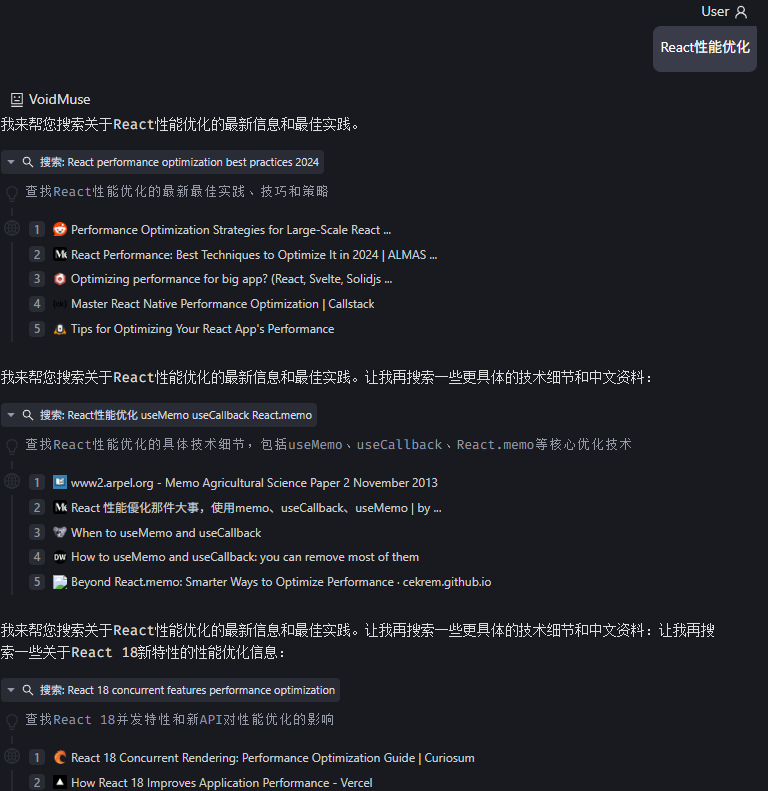
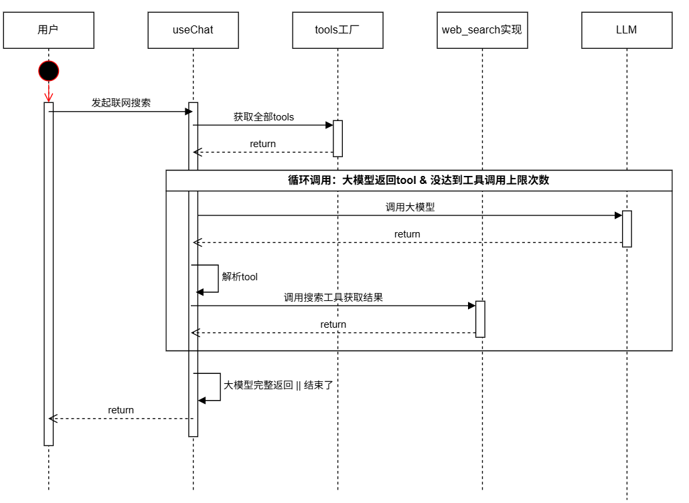
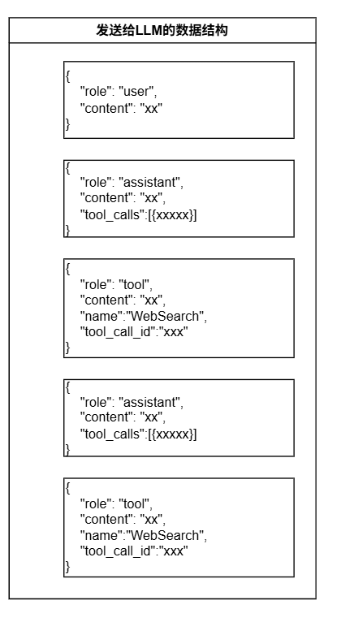
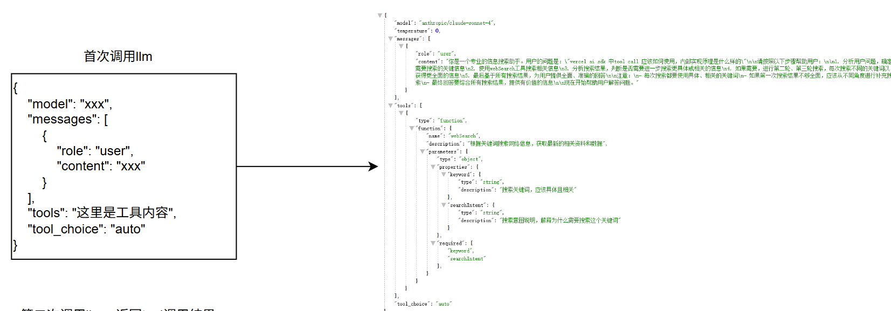
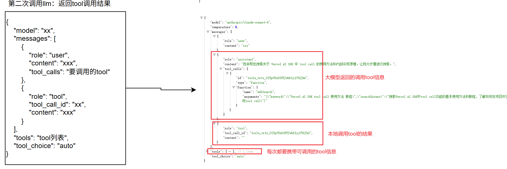
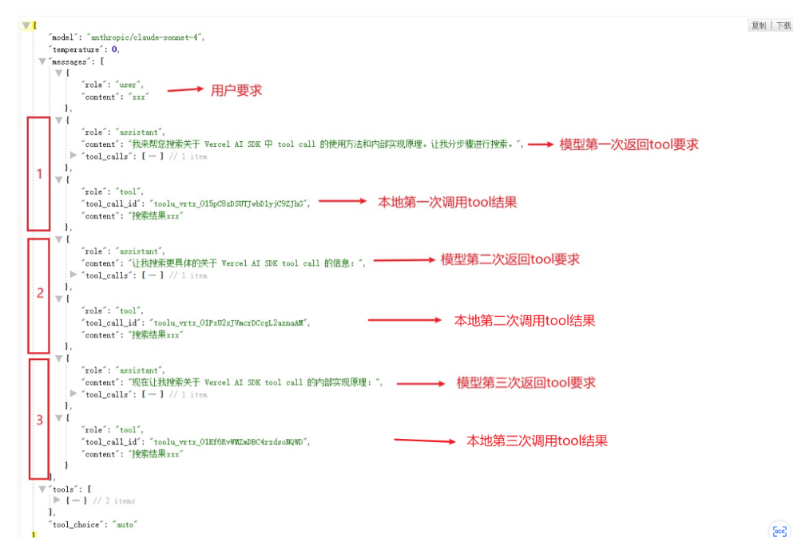

# function call的实践-实现深度搜索

## 1. 深度搜索和传统搜索的区别

传统搜索模式通常只进行一次查询，用户输入关键词后，搜索引擎返回与该关键词匹配的结果。但实际上，我们在搜索内容时，很难一下子就搜索到自己满意的内容，需要根据已获取的信息，不断迭代搜索，才能获取到自己满意的结果。

例如，当搜索"React性能优化"时，传统搜索只会返回与这个关键词直接相关的结果，而不会自动深入到"React虚拟DOM优化"、"React组件懒加载"等更具体的领域。

深度搜索突破了传统搜索的限制，通过多轮迭代搜索实现更全面、更深入的信息获取：
- 首次搜索后，系统分析搜索结果
- 基于已获取的信息，自动生成新的、更精确的搜索词
- 使用新搜索词进行下一轮搜索
- 不断迭代，直到获取足够全面的信息或达到预设的搜索深度

这种方式模拟了专业研究人员的搜索行为，每一轮搜索都建立在前一轮获取的知识基础上，逐步深入和扩展信息范围。

深度搜索效果如下：


## 2. Function Call 与深度搜索
想要实现深度搜索，就要利用到 Function Call 能力，LLM通过function call调用搜索工具，不断迭代搜索

### 2.1 Function Call 的基本概念

Function Call（函数调用）是大语言模型（LLM）的一项关键能力，允许模型在对话过程中调用预定义的函数或工具。在深度搜索中，Function Call扮演着核心角色：

- 模型可以决定何时需要调用搜索工具
- 模型可以生成适当的搜索关键词
- 模型可以分析搜索结果并决定下一步行动

### 2.2 深度搜索的时序图

深度搜索的实现涉及LLM、应用程序和搜索引擎之间的复杂交互：


深度搜索实现的关键：循环调用大模型，直到大模型不再请求搜索工具，或者达到最大搜索次数。

#### 2.2.1 LLM决策过程
1. 接收用户查询
2. 分析查询内容，判断是否需要搜索外部信息
3. 如需搜索，生成适当的搜索关键词
4. 分析搜索结果，决定是否需要进一步搜索
5. 如需进一步搜索，生成新的搜索关键词
6. 当获取足够信息后，综合所有结果回答用户

#### 2.2.2 工具调用流程
1. 应用程序向LLM发送包含工具定义的请求
2. LLM返回工具调用请求（包含搜索关键词）
3. 应用程序执行搜索并获取结果
4. 应用程序将搜索结果返回给LLM
5. 重复步骤2-4，直到LLM不再请求搜索或达到最大搜索次数

### 2.3 搜索工具的声明与使用

#### 2.3.1 伪代码实现-直接接入llm api实现
深度搜索的伪代码实现：对接llm api
```javascript
while(result.toolCall 存在 || maxStepCount 未到) {
  // 调用搜索工具
  const searchResult = await callSearchTool(toolCall);
  
  // 调用大模型: 需要把历史数据也传递给大模型
  result = await callLLM(history, searchResult);
}
```

调用llm的数据参数可参考图片：包含了两次工具调用


调用llm的完整参数结构：每次都要携带完整的历史上下文过去，包含了前几次llm返回的工具



3次搜索工具调用时，第3次本地搜索完成后调用llm时所传递的完整参数如下图


#### 2.3.2 使用vercel ai sdk实现
vercel ai sdk：封装了多轮工具调用，知道了原理后直接使用封装好的sdk会更加高效，不需要自己再造轮子了

在实现深度搜索时，需要向LLM提供搜索工具的定义。以下是一个典型的搜索工具定义示例：

```javascript
const searchTool = {
  name: "webSearch",
  description: "搜索互联网获取最新信息",
  parameters: {
    type: "object",
    properties: {
      query: {
        type: "string",
        description: "搜索关键词"
      }
    },
    required: ["query"]
  }
};
```

在Vercel AI SDK中，工具的使用方式如下：

```typescript
const result = streamText({
    model: model,
    messages: messages,
    system: systemPrompt,
    tools: [searchTool],  // 提供搜索工具定义
    stopWhen: stepCountIs(5),  // 限制最大搜索次数
    abortSignal: abortController.current?.signal,
    onError: handleError
});
```

## 3. 深度搜索的控制机制

### 3.1 LLM自主判断结束条件

深度搜索的一个关键特性是LLM能够自主判断何时应该结束搜索：

- 当LLM认为已获取足够信息时，不再返回工具调用请求
- 当LLM发现后续搜索可能不会提供新信息时，停止搜索
- 当LLM确定问题已经得到完整回答时，结束搜索过程

这种自主判断机制使深度搜索既能获取全面信息，又能避免无效搜索，提高效率。

### 3.2 最大工具调用次数限制（stopWhen: stepCountIs(5)）

尽管LLM能够自主判断搜索结束条件，但为了防止潜在的无限循环或过度搜索，设置最大工具调用次数限制是必要的：

```typescript
stopWhen: stepCountIs(5)  // 限制最多进行5次工具调用
```

这个参数确保即使LLM持续请求更多搜索，系统也会在达到预设次数后强制结束搜索过程。

### 3.3 防御性设计的必要性

在实现深度搜索时，防御性设计至关重要：

- **防止无限循环**：LLM可能陷入持续搜索的循环，必须设置最大调用次数
- **控制资源消耗**：每次搜索都消耗API调用和计算资源，需要合理限制
- **避免信息过载**：过多的搜索结果可能导致信息过载，反而降低回答质量

## 4. 实际应用案例

### 4.1 代码示例解析

以下是使用Vercel AI SDK实现深度搜索的核心代码

```typescript
const result = streamText({
    model: model,
    messages: MessageConverter.getInstance().convertToApiFormat(historyList.map(msg => msg.message), promptContent),
    system: PromptService.getSystemPrompt({
        modelName: modelRef.current?.name || '',
        projectInfo: projectInfo,
        tools: tools
    }),
    tools: tools,
    stopWhen: stepCountIs(5),
    abortSignal: abortController.current?.signal,
    onError: (error) => {
        handleApiError(error, onUpdate, onSuccess, selectedModel);
    }
});
```

```ts
export const webSearchTool = tool({
  description: 'Search the web for information based on keywords to obtain the latest relevant materials and data',
  inputSchema: z.object({
    keyword: z.string().describe('Search keyword should be specific and relevant. Please automatically determine based on the nature of the search content: use English keywords for international content like technical documentation, international news, academic materials; use Chinese keywords for Chinese information, localized content, Chinese community discussions. Choose the language that will yield the most accurate search results.'),
    searchIntent: z.string().describe('Search intent explanation, describe why you need to search for this keyword')
  }),
  execute: async ({ keyword, searchIntent }) => {
    try {
      const result = await searchService.onlineSearch(keyword);
      
      if (result.success) {
        return {
          success: true,
          keyword,
          searchIntent,
          results: result.results.map(item => ({
            title: item.title || '',
            url: item.url,
            snippet: item.description,
            favicon: item.favicon || '',
          }))
        };
      } else {
        return {
          success: false,
          error: result.msg || 'Search failed',
          keyword,
          searchIntent
        };
      }
    } catch (error) {
      return {
        success: false,
        error: error instanceof Error ? error.message : 'Unknown error occurred',
        keyword,
        searchIntent
      };
    }
  }
});

export type WebSearchResult = {
  success: boolean;
  keyword: string;
  searchIntent: string;
  results?: Array<{
    title: string;
    url: string;
    snippet: string;
    favicon: string;
  }>;
  error?: string;
};
```

## 5. 不同模型的表现对比

实际测试中，Claude 3.7+ 和 OpenAI O系列模型是能做到搜索多次的，但 GPT-4o-mini 就经常只会触发一次搜索，而不会深度多次搜索，这也就意味着 GPT-4o-mini 模拟在agent场景的能力上是偏弱的，在需要深度搜索的场景下，建议使用Claude 3.7+